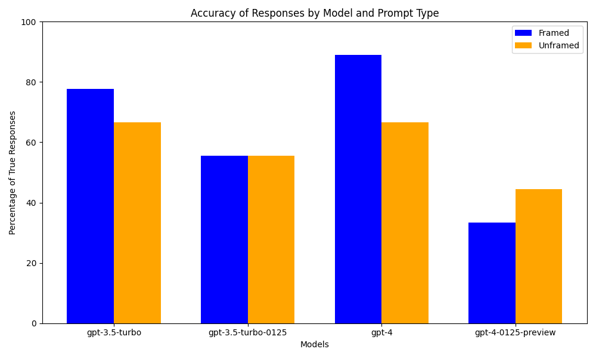

# Assessing the Effects of Framing on Model Outputs

This repository contains a Python application designed to evaluate how framings prompts differently affects the responses generated by OpenAI's Large Language Models. It includes tools to process YAML files containing various framed and unframed prompts, submit these prompts to the OpenAI API, collecting the responses, and visualizing the results.

## Pilot Study Summary
### Hypothesis:
Our study hypothesized that the framing of prompts (framed vs. unframed) significantly affects the accuracy and type of responses generated by OpenAI's language models. Specifically, we expected that framed prompts, which include additional context or constraints, would lead to more accurate or contextually appropriate responses compared to unframed prompts.

### Methodology
Prompt Selection: We selected a variety of prompts from different domains (history, logic, math) and created two versions of each—framed and unframed.
Response Collection: Using OpenAI's GPT models, we submitted these prompts and collected the responses. Each prompt was processed by the models to generate responses, which were then stored for analysis.
Data Analysis: Responses were evaluated for correctness based on predefined correct answers. The analysis focused on comparing the correctness of responses between framed and unframed prompts across different models.
Visualization: The results were visualized using a bar chart that represents the percentage of correct responses for each type of prompt across different models.
Findings
Our initial findings indicate a variability in response correctness between framed and unframed prompts across different models. The visualization (included below) shows how each model performed under the different framing conditions. Generally, framed prompts tended to result in higher correctness rates, supporting our hypothesis that framing can influence the quality of AI-generated responses.

### Output Visualization

Below is the bar chart representing our findings from the pilot study:



### Next Steps
Given the insights from this pilot study, we suggest the following areas for future work:

Increased Sample Size: To enhance the robustness of our findings, conducting a larger study with more prompts and multiple runs per prompt can help minimize variability and provide more statistically significant results.
Diverse Models: Testing with a broader range of models, including newer versions and different configurations, to assess if the observed trends hold across various AI technologies.
Longitudinal Analysis: Examining the effects of prompt framing over time, especially as models are updated and trained on new data, could provide insights into how persistent these effects are.
Qualitative Analysis: Beyond correctness, analyzing the nuances of how responses change with framing could yield deeper insights into model behavior and prompt design principles.
Output Visualization
Correctness of Responses by Prompt Type and Model

We also recommend applying this methodology to a wide range of prompt engineering techniques in order to quantify the effect of these techniques on output quality.
- Include details in your query
- Ask the model to adopt a persona
- Use of delimiters to clearly indicate distinct parts of the input
- Specify the steps required to complete a task
- Provide examples responses

This pilot study serves as a foundation for understanding the impact of prompt framing on AI-generated text, However, this methodology can be applied to a wide variety of prompt engineering questions. We look forward to continuing this research.

## Features

- **Prompt Processing**: Converts YAML prompt definitions into queries for the OpenAI API.
- **Response Collection**: Gathers and stores responses from the OpenAI API.
- **Configurable**: Uses a config file to manage API keys and other settings securely.


## Prerequisites

Before you begin, ensure you have the following installed:
- Python 3.7 or higher
- pip (Python package installer)


## Installation

Clone the repository to your local machine:

```bash
git clone https://github.com/yourusername/assessing-the-effects-framing-on-model-outputs.git
cd assessing-the-effects-framing-on-model-outputs
```

Install the required Python packages:
```bash
pip install -r requirements.txt
```

## Configuration

Copy the config_template.ini to config.ini and replace INSERT_YOUR_API_KEY_HERE with your actual OpenAI API key:
```ini
[openai]
api_key = your-real-api-key
Note: Do not commit config.ini to your version control system.
```

## Usage
To run the application and process the prompts, use:
```bash
python prompt_processor.py
```
This script reads the prompts from prompts.yaml, interacts with the OpenAI API, and stores the responses in output_responses.json.


## Testing
Run the unit tests to ensure that everything is set up correctly:
```bash
python -m unittest discover tests
```

### Helpful Tip
If you want to share your work with a larger language model, this is a useful command ;-)
```bash
find . -type f ! -name '*.png' ! -path './.git/*' ! -path './venv/*' ! -path './__pycache__/*' -exec echo {} \; -exec cat {} \;
```
or 
```bash
for file in README.md ai_interface.py prompt_processor.py utilities.py visualization.py; do echo "File: $file"; cat "$file"; echo; done
'''